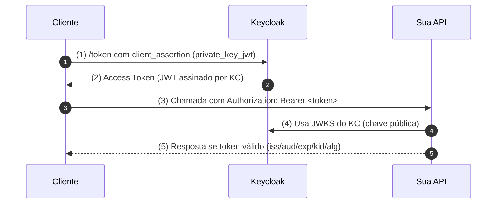

# Ultra Simple S2S — JWT Only (Keycloak 26 + Spring Boot 3)

Stack local (sem HMAC/JWE), só **JWT**:
- Keycloak 26 (realm `api`, client `api-client`, `private_key_jwt`)
- API (Spring Boot) como Resource Server (valida JWT do KC)
- Nginx como gateway (https://localhost:8443), roteando:
  - `/kc/*` → Keycloak
  - `/api/*` → API

## Como subir (local)
```bash
make certs        # gera self-signed para o Nginx (uma vez)
make up-local     # sobe postgres + keycloak + api + nginx
```

## Testes rápidos
```bash
# Descoberta OIDC / issuer
curl -sk https://localhost:8443/kc/realms/api/.well-known/openid-configuration | jq .issuer

# Health
curl -sk https://localhost:8443/api/healthz | jq .
```

## Como obter token (client_credentials + private_key_jwt)
1) Gere/parque sua chave **privada** do cliente em `client-keys/private.pem` (PKCS#8).
2) Publique a **pública** em `./resource-server/resource-server/static/.well-known/api-client.jwks.json` (já deixamos um JWKS DEMO).
3) Faça a **client_assertion** (use sua ferramenta favorita) e chame o `/kc/realms/api/protocol/openid-connect/token`:
```bash
curl -sk https://localhost:8443/kc/realms/api/protocol/openid-connect/token   -H "Content-Type: application/x-www-form-urlencoded"   --data-urlencode "grant_type=client_credentials"   --data-urlencode "client_id=api-client"   --data-urlencode "client_assertion_type=urn:ietf:params:oauth:client-assertion-type:jwt-bearer"   --data-urlencode "client_assertion=<<JWT_ASSINADO_PELO_CLIENTE>>"
```

Com o access token em mãos:
```bash
ACCESS_TOKEN="..."
curl -sk https://localhost:8443/api/echo   -H "Authorization: Bearer $ACCESS_TOKEN"   -H "Content-Type: application/json"   --data '{"msg":"olá"}' | jq .
```

## Como funciona (para humanos)
Pense em **3 personagens**: Cliente, Keycloak, API.



## Postman
Importe `postman/jwt-only.postman_collection.json` e preencha `{{accessToken}}`.

## Produção (api.greijal.app)

1) Tenha os certificados públicos do Let's Encrypt no **host**:
   - `/etc/letsencrypt/live/api.greijal.app/fullchain.pem`
   - `/etc/letsencrypt/live/api.greijal.app/privkey.pem`

2) Suba o compose de produção:
```bash
docker compose -f docker-compose.prod.yml up -d --build
```

3) Testes rápidos:
```bash
curl -sk https://api.greijal.app/api/healthz | jq .
curl -sk https://api.greijal.app/kc/realms/api/.well-known/openid-configuration | jq .issuer
curl -sk https://api.greijal.app/.well-known/api-client.jwks.json | jq .
```

> O Nginx publica o JWKS em `/.well-known/api-client.jwks.json`. Aponte o **Client (api-client)** do Keycloak para essa URL como **JWKS URL**.
